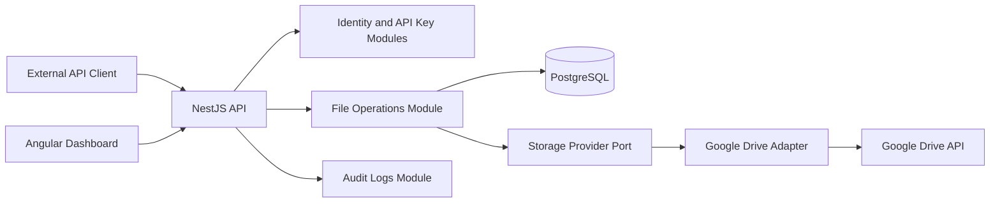

# O2 Snapshot: Architecture & Design

## Snapshot Metadata

- Snapshot ID: O2
- Phase completed: F2 -- Architecture & Design
- Timestamp: 2026-05-24
- Gate status: APPROVED_WITH_RISKS
- Frozen sections: architecture

## Classification

- Product type: SaaS/API developer tool
- Complexity: medium
- Criticality: medium-high because SID3 handles OAuth tokens, API keys, and user file access
- Recommended architecture: modular monolith with Clean/Hexagonal module boundaries

## Architecture Pattern

SID3 will start as a modular monolith. Each backend module owns its use cases, domain rules, and ports. Infrastructure adapters implement Google Drive access, Prisma repositories, token encryption, hashing, logging, and external HTTP behavior.

Microservices are intentionally deferred. Current scale and team assumptions do not justify distributed deployment, duplicated observability, distributed transactions, or cross-service contract overhead.

## Backend Modules

- Identity and sessions
- Projects
- API keys
- Provider integrations
- Buckets
- Objects and metadata
- File operations
- Audit logs

## Component View

## Data Flows

- Dashboard login: user credentials -> SID3 identity -> JWT/session -> dashboard API calls.
- Google connection: dashboard -> OAuth redirect -> Google callback -> encrypted token storage.
- API key operation: external client -> API key lookup and hash verification -> project authorization.
- Upload: API client -> bucket/object validation -> Google Drive adapter -> metadata persisted -> audit log.
- Download: API client -> object authorization -> Google Drive adapter -> streamed response -> audit log.
- Delete: API client -> object authorization -> Google Drive adapter delete/trash -> metadata update -> audit log.

## Technology Stack

- Node.js and TypeScript
- NestJS backend
- Angular dashboard
- PostgreSQL
- Prisma
- Redis optional
- OpenAPI
- Docker Compose for local dependencies
- Jest, Supertest, and Angular tests
- pnpm

## Infrastructure Strategy

- Local development: Docker Compose for PostgreSQL and optional Redis.
- MVP deployment: one API service, one dashboard deployment, managed or containerized PostgreSQL.
- Google Drive stores file bytes; PostgreSQL stores SID3 metadata and provider mappings.
- Redis remains optional until rate limiting, retry coordination, or background jobs require it.
- Start with low-cost deployment targets; keep container boundaries clean enough for later migration.

## Security Model

- Dashboard uses authenticated user sessions/JWT.
- External file API uses project-scoped API keys.
- API keys are hashed at rest and displayed only once.
- Google OAuth tokens are encrypted at rest.
- OAuth scopes must be minimal, with `drive.file` as the preferred starting point unless contracts prove insufficient.
- Every file operation checks user/project/bucket/object ownership.
- Provider tokens, API key secrets, and file contents are excluded from logs.
- Operation logs are mandatory for upload, download, listing, delete, OAuth connect, OAuth revoke, and API key lifecycle events.

## External Integrations

- Google OAuth 2.0
- Google Drive API

## F2 Quality Gate

- Architecture pattern selected with ADR: PASS
- Technology stack locked with justification: PASS
- Security model defined with basic threat awareness: PASS
- Infrastructure strategy defined: PASS
- External integration contracts cataloged: PASS
- Contradictory architecture decisions detected: NONE

Gate result: APPROVED_WITH_RISKS
