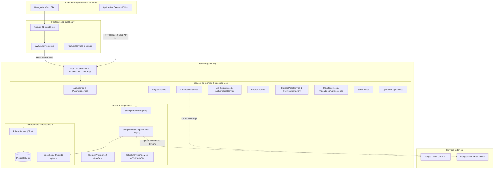
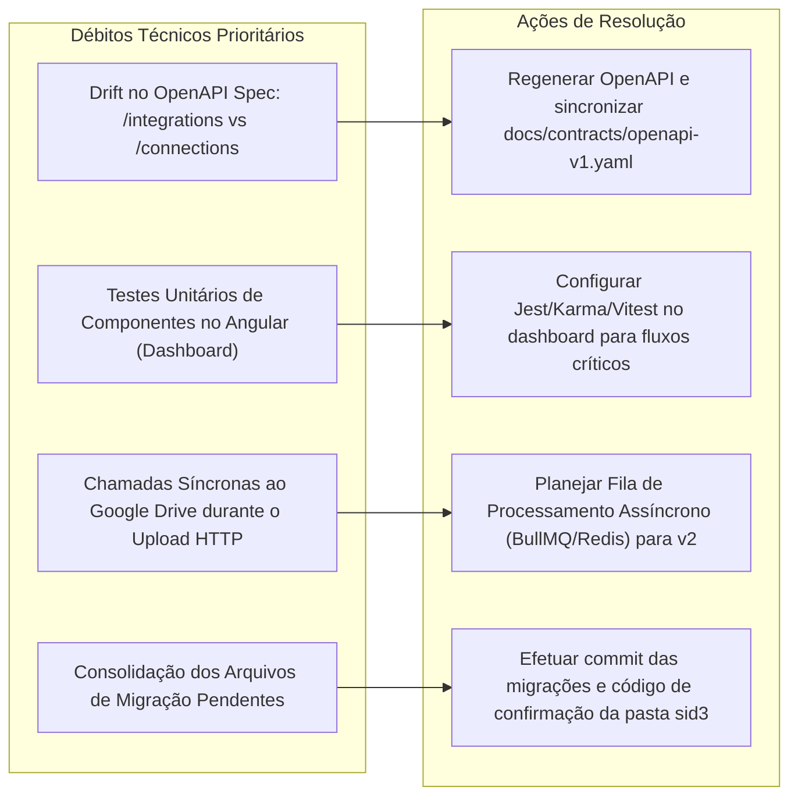
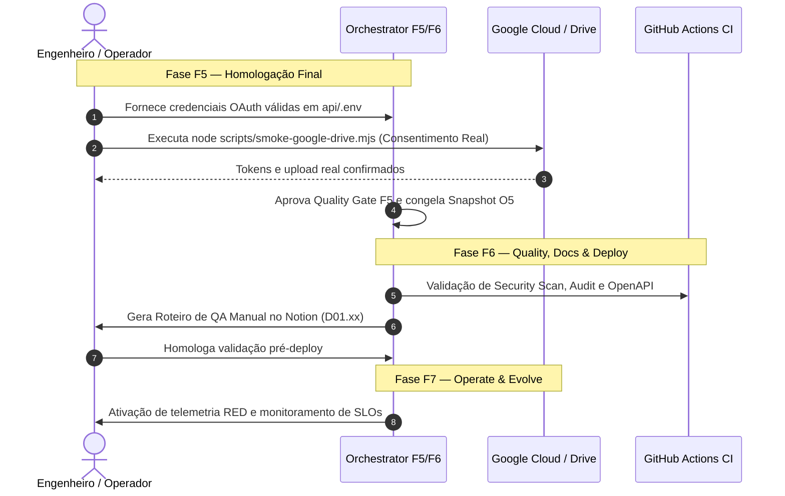

# Overview Arquitetural e Diagnóstico Executivo — SID3 (SInsideDrive3)

> **Documento Gerado pelo Autonomous Software Orchestrator**  
> **Classificação**: Produto SaaS | **Complexidade**: Alta | **Criticidade**: Alta  
> **Fase Atual da Esteira**: **F5 — Engineering Execution** (Baseline Local Validado; Pendente Smoke Test Real)  
> **Último Snapshot Estável**: [O4 — UX & Planning](file:///home/isaiasgr/%C3%81rea%20de%20trabalho/Projetos/github/SID3/docs/orchestration/snapshots/O4-ux-planning.md)  
> **Rastreabilidade Canônica**: [context.json](file:///home/isaiasgr/%C3%81rea%20de%20trabalho/Projetos/github/SID3/docs/orchestration/context.json) | [AGENT.md](file:///home/isaiasgr/%C3%81rea%20de%20trabalho/Projetos/github/SID3/AGENT.md)

---

## 1. Resumo Executivo & Estado Atual da Orquestração

### 1.1. O que é o SID3
O **SID3 (SInsideDrive3)** é uma plataforma SaaS e gateway de armazenamento em nuvem que abstrai e unifica o **Google Drive** como backend de armazenamento de alta disponibilidade e baixo custo, expondo uma camada com semântica moderna orientada a objetos (similar a serviços como Amazon S3 e Cloudflare R2).

O sistema resolve quatro dores centrais do mercado:
1. **Complexidade de Integração Direta**: Elimina a necessidade de cada aplicação cliente implementar a Google Drive API, fluxos OAuth complexos, renovação de tokens e gerenciamento de arquivos.
2. **Abstração Multi-Drive e Pools de Storage**: Permite agrupar múltiplas contas do Google Drive em *Storage Pools* virtuais com estratégias automáticas de balanceamento (`ROUND_ROBIN`, `FILL_FIRST`, `WEIGHTED`), transformando capacidades dispersas em um pool contínuo de armazenamento.
3. **Isolamento e Segurança Unificada**: Fornece autenticação própria por usuário (JWT) e autenticação de máquina para máquina via **API Keys** de escopo por projeto com rotação e regeneração de segredos sem vazamento de dados.
4. **Governança e Rastreabilidade Operacional**: Trilha de auditoria completa (*Operation Logs*) para cada operação de upload, download, listagem, exclusão e gestão de acessos, com correlação de transação via `requestId`.

### 1.2. Proposta de Valor e Modelo de Negócio
- **Público-Alvo**: Desenvolvedores independentes, startups em estágio inicial (Early-stage SaaS), pequenas empresas e criadores de automações que já dispõem de capacidade de armazenamento no Google Workspace ou contas pessoais e necessitam de uma ponte simples e segura para arquivos via API REST.
- **Modelo de Negócio**: Fase inicial (MVP) focada em adoção técnica sem cobrança; evolução planejada para modelo freemium com planos baseados em volume de operações, número de contas conectadas, suporte a times e recursos avançados de CDN e gateway compatível com S3.

### 1.3. Estado Canônico da Orquestração e Quality Gates
A governança autônoma do SID3 segue a esteira de 7 fases do orquestrador. O estado atual de cada fase está sintetizado abaixo:

| Fase | Título | Snapshot | Status do Quality Gate | Observações Críticas |
|---|---|---|---|---|
| **F1** | Discovery & Strategy | [O1](file:///home/isaiasgr/%C3%81rea%20de%20trabalho/Projetos/github/SID3/docs/orchestration/snapshots/O1-discovery-strategy.md) | **APPROVED_WITH_RISKS** | Escopo MVP congelado ([ADR-0001](file:///home/isaiasgr/%C3%81rea%20de%20trabalho/Projetos/github/SID3/docs/orchestration/adr/ADR-0001-product-scope-mvp.md)). Riscos de quotas e aprovação OAuth mapeados. |
| **F2** | Architecture & Design | [O2](file:///home/isaiasgr/%C3%81rea%20de%20trabalho/Projetos/github/SID3/docs/orchestration/snapshots/O2-architecture-design.md) | **APPROVED_WITH_RISKS** | Monólito modular com Ports & Adapters ([ADR-0002](file:///home/isaiasgr/%C3%81rea%20de%20trabalho/Projetos/github/SID3/docs/orchestration/adr/ADR-0002-architecture-pattern.md)), criptografia de tokens ([ADR-0004](file:///home/isaiasgr/%C3%81rea%20de%20trabalho/Projetos/github/SID3/docs/orchestration/adr/ADR-0004-security-model.md)). |
| **F3** | Data & API Contracts | [O3](file:///home/isaiasgr/%C3%81rea%20de%20trabalho/Projetos/github/SID3/docs/orchestration/snapshots/O3-data-api-contracts.md) | **APPROVED_WITH_RISKS** | Modelo de dados PostgreSQL via Prisma e especificação OpenAPI v1 gerada. |
| **F4** | UX/UI & Planning | [O4](file:///home/isaiasgr/%C3%81rea%20de%20trabalho/Projetos/github/SID3/docs/orchestration/snapshots/O4-ux-planning.md) | **APPROVED_WITH_RISKS** | Jornadas de usuário validadas ([journeys.md](file:///home/isaiasgr/%C3%81rea%20de%20trabalho/Projetos/github/SID3/docs/ux/journeys.md)), wireframes estruturais e backlog técnico gerado. |
| **F5** | Engineering Execution | [O5 (Em Curso)](file:///home/isaiasgr/%C3%81rea%20de%20trabalho/Projetos/github/SID3/docs/engineering/f5-progress.md) | **IN_PROGRESS (95% Concluído)** | Baseline local de engenharia 100% aprovado. Falta apenas o teste de fumaça interativo com conta Google real. |
| **F6** | Quality, Docs & Deploy | — | **AGUARDANDO F5** | Auditoria pré-deploy, testes de penetração, documentação operacional e checklist Notion de QA manual. |
| **F7** | Operate & Evolve | — | **AGUARDANDO F6** | Observabilidade em produção, definição formal de SLOs/SLAs e telemetria RED. |

> [!IMPORTANT]
> **Único Bloqueador para Fechamento do Gate F5**: Execução do roteiro [google-drive-smoke-test.md](file:///home/isaiasgr/%C3%81rea%20de%20trabalho/Projetos/github/SID3/docs/operations/google-drive-smoke-test.md) via script [smoke-google-drive.mjs](file:///home/isaiasgr/%C3%81rea%20de%20trabalho/Projetos/github/SID3/scripts/smoke-google-drive.mjs), dependente de credenciais reais do Google Cloud Console (`GOOGLE_OAUTH_CLIENT_ID` e `GOOGLE_OAUTH_CLIENT_SECRET`) com consentimento humano na tela OAuth.

---

## 2. Arquitetura Global & Padrões Estruturais

O SID3 foi concebido como um **Monólito Modular** com aplicação rigorosa do padrão **Ports & Adapters (Arquitetura Hexagonal)** e princípios de **Clean Architecture**, balanceados para evitar overengineering ([ADR-0002](file:///home/isaiasgr/%C3%81rea%20de%20trabalho/Projetos/github/SID3/docs/orchestration/adr/ADR-0002-architecture-pattern.md)).



### 2.1. Princípio da Precedência das Fontes de Verdade
Conforme as diretrizes canônicas de orquestração:
$$\text{Código Executável e Contratos OpenAPI} \succ \text{ADRs} \succ \text{OrchestratorContext} \succ \text{Documentação Markdown} \succ \text{Índices Derivados}$$
Quando ocorre *drift* entre o código e documentos, **o código e os testes prevalecem**, disparando reconciliação (*self-healing*) na documentação.

### 2.2. Stack Tecnológica Detalhada

| Camada | Tecnologia | Versão | Justificativa / Papel Arquitetural |
|---|---|---|---|
| **Linguagem** | [TypeScript](file:///home/isaiasgr/%C3%81rea%20de%20trabalho/Projetos/github/SID3/api/tsconfig.json) | 5.9.3 | Tipagem estrita ponta a ponta sem uso de `any` em DTOs e entidades. |
| **Runtime** | Node.js | 24+ LTS | Suporte nativo a ESM, alta performance de I/O de rede e streams assíncronos. |
| **Backend** | [NestJS](file:///home/isaiasgr/%C3%81rea%20de%20trabalho/Projetos/github/SID3/api/package.json) | 11.1.23 | Framework corporativo robusto para monólitos modulares, DI nativa e decorators. |
| **Banco de Dados** | PostgreSQL | 16 | ACID relacional com suporte a UUID v4 nativo, tipos BigInt e integridade referencial estrita. |
| **ORM / Migrations** | [Prisma](file:///home/isaiasgr/%C3%81rea%20de%20trabalho/Projetos/github/SID3/api/prisma/schema.prisma) | 6.19.3 | Type-safety na camada de persistência e controle declarativo de migrações SQL versionadas. |
| **Frontend** | [Angular](file:///home/isaiasgr/%C3%81rea%20de%20trabalho/Projetos/github/SID3/dashboard/package.json) | 21.2.12 | Standalone components, novos control flows (`@if`, `@for`), Signals e OnPush Change Detection. |
| **Integração Externa** | [googleapis](file:///home/isaiasgr/%C3%81rea%20de%20trabalho/Projetos/github/SID3/api/package.json) / [google-auth-library](file:///home/isaiasgr/%C3%81rea%20de%20trabalho/Projetos/github/SID3/api/package.json) | 172.0 / 10.6 | SDK oficial da Google para comunicação direta e gestão de tokens OAuth. |
| **Criptografia** | Node.js `crypto` | Nativo | Criptografia autenticada AES-256-GCM e hashing com SHA-256 / bcryptjs. |
| **Infraestrutura Local** | Docker Compose | 3.8 | Orquestração local simplificada de PostgreSQL e Redis (opcional). |

---

## 3. Módulos de Domínio & Bounded Contexts

O backend divide-se em 10 módulos funcionais dentro de [`api/src/modules/`](file:///home/isaiasgr/%C3%81rea%20de%20trabalho/Projetos/github/SID3/api/src/modules):

### 3.1. Identidade & Autenticação (`Identity / Auth`)
- **Arquivos**: [`auth.controller.ts`](file:///home/isaiasgr/%C3%81rea%20de%20trabalho/Projetos/github/SID3/api/src/modules/auth/auth.controller.ts), [`auth.service.ts`](file:///home/isaiasgr/%C3%81rea%20de%20trabalho/Projetos/github/SID3/api/src/modules/auth/auth.service.ts), [`password.service.ts`](file:///home/isaiasgr/%C3%81rea%20de%20trabalho/Projetos/github/SID3/api/src/modules/auth/password.service.ts), [`jwt-auth.guard.ts`](file:///home/isaiasgr/%C3%81rea%20de%20trabalho/Projetos/github/SID3/api/src/common/auth/jwt-auth.guard.ts).
- **Responsabilidade**: Gerenciamento de credenciais de usuários do painel. Registro (`/auth/register`), login (`/auth/login`) e consulta do usuário logado (`/me`).
- **Segurança**: Senhas processadas com `bcryptjs` (salt rounds = 10). Emissão de JWT assinado com chave secreta segura.
- **Multitenancy**: Todas as entidades do sistema derivam direta ou indiretamente do `userId` do token JWT autenticado.

### 3.2. Projetos (`Projects`)
- **Arquivos**: [`projects.controller.ts`](file:///home/isaiasgr/%C3%81rea%20de%20trabalho/Projetos/github/SID3/api/src/modules/projects/projects.controller.ts), [`projects.service.ts`](file:///home/isaiasgr/%C3%81rea%20de%20trabalho/Projetos/github/SID3/api/src/modules/projects/projects.service.ts).
- **Responsabilidade**: Agrupador lógico e fronteira de isolamento de recursos.
- **Invariante**: Cada projeto possui um `slug` único por usuário (`@@unique([ownerUserId, slug])`). Buckets, API Keys, Storage Pools e Logs operacionais são estritamente particionados pelo `projectId`.

### 3.3. Conexões & OAuth Google (`Connections`)
- **Arquivos**: [`connections.controller.ts`](file:///home/isaiasgr/%C3%81rea%20de%20trabalho/Projetos/github/SID3/api/src/modules/connections/connections.controller.ts), [`connections.service.ts`](file:///home/isaiasgr/%C3%81rea%20de%20trabalho/Projetos/github/SID3/api/src/modules/connections/connections.service.ts), [`token-encryption.service.ts`](file:///home/isaiasgr/%C3%81rea%20de%20trabalho/Projetos/github/SID3/api/src/common/security/token-encryption.service.ts).
- **Evolução Arquitetural ([ADR-0007](file:///home/isaiasgr/%C3%81rea%20de%20trabalho/Projetos/github/SID3/docs/orchestration/adr/ADR-0007-multi-drive-per-user.md))**:
  - Originalmente, o sistema permitia apenas 1 conta Google por usuário via upsert. O [ADR-0007](file:///home/isaiasgr/%C3%81rea%20de%20trabalho/Projetos/github/SID3/docs/orchestration/adr/ADR-0007-multi-drive-per-user.md) abriu o suporte para **Multi-Drive por usuário**, permitindo conectar N contas simultâneas, identificadas por `displayName` e `providerAccountEmail`.
  - O módulo foi renomeado de `integrations` para `connections`.
- **Segurança de Tokens**: Os tokens de acesso e refresh do Google Drive **nunca** são expostos na API e são criptografados em repouso no banco com **AES-256-GCM** com IV aleatório e tag de autenticação de 16 bytes.
- **Proteção contra Replay de OAuth**: O fluxo de consentimento gera um `OAuthState` efêmero; o hash SHA-256 do state é persistido com expiração de 10 minutos e invalidado imediatamente no callback (`consumedAt`).
- **Reautorização**: Endpoint `POST /connections/:id/reauthorize` para restabelecer permissões sem perder o ID da conexão.

### 3.4. API Keys (`ApiKeys`)
- **Arquivos**: [`api-keys.controller.ts`](file:///home/isaiasgr/%C3%81rea%20de%20trabalho/Projetos/github/SID3/api/src/modules/api-keys/api-keys.controller.ts), [`api-keys.service.ts`](file:///home/isaiasgr/%C3%81rea%20de%20trabalho/Projetos/github/SID3/api/src/modules/api-keys/api-keys.service.ts), [`api-key-secret.service.ts`](file:///home/isaiasgr/%C3%81rea%20de%20trabalho/Projetos/github/SID3/api/src/modules/api-keys/api-key-secret.service.ts), [`api-key-auth.guard.ts`](file:///home/isaiasgr/%C3%81rea%20de%20trabalho/Projetos/github/SID3/api/src/common/auth/api-key-auth.guard.ts).
- **Formato da Chave**: `sid3_<prefix>_<secret>`.
- **Estratégia Zero-Knowledge de Segredo**:
  - O banco de dados armazena apenas o `prefix` (único, para busca rápida) e o `secretHash` (SHA-256).
  - O segredo completo é exibido **uma única vez** no momento da criação ou regeneração.
- **Regeneração in-place ([ADR-0010](file:///home/isaiasgr/%C3%81rea%20de%20trabalho/Projetos/github/SID3/docs/orchestration/adr/ADR-0010-api-key-regeneration.md))**:
  - Endpoint `POST /projects/:projectId/api-keys/:apiKeyId/regenerate`.
  - Permite gerar um novo segredo e prefixo mantendo o mesmo ID de registro, nome e histórico de logs, invalidando o segredo anterior instantaneamente.
- **Autenticação**: O guarda [`ApiKeyAuthGuard`](file:///home/isaiasgr/%C3%81rea%20de%20trabalho/Projetos/github/SID3/api/src/common/auth/api-key-auth.guard.ts) intercepta o cabeçalho `X-SID3-API-Key`, localiza o registro pelo prefixo, valida o hash em tempo constante, verifica se a chave não foi revogada (`revokedAt == null`) e atualiza o timestamp `lastUsedAt`.

### 3.5. Buckets Virtuais (`Buckets`)
- **Arquivos**: [`buckets.controller.ts`](file:///home/isaiasgr/%C3%81rea%20de%20trabalho/Projetos/github/SID3/api/src/modules/buckets/buckets.controller.ts), [`buckets-api.controller.ts`](file:///home/isaiasgr/%C3%81rea%20de%20trabalho/Projetos/github/SID3/api/src/modules/buckets/buckets-api.controller.ts), [`buckets.service.ts`](file:///home/isaiasgr/%C3%81rea%20de%20trabalho/Projetos/github/SID3/api/src/modules/buckets/buckets.service.ts).
- **Conceito**: Contêiner lógico de arquivos com garantia de unicidade de nome por projeto (`UNIQUE(projectId, name)`).
- **Associação Híbrida**:
  - Pode apontar para uma conexão direta (`providerIntegrationId`) OU para um pool multi-drive (`storagePoolId`), sendo mutuamente exclusivos.
  - Expõe endpoints tanto para o painel administrativo (autenticado por JWT) quanto via API pública (autenticado por API Key).

### 3.6. Pools de Armazenamento & Balanceamento Multi-Drive (`StoragePools`)
- **Arquivos**: [`storage-pools.controller.ts`](file:///home/isaiasgr/%C3%81rea%20de%20trabalho/Projetos/github/SID3/api/src/modules/storage-pools/storage-pools.controller.ts), [`storage-pools.service.ts`](file:///home/isaiasgr/%C3%81rea%20de%20trabalho/Projetos/github/SID3/api/src/modules/storage-pools/storage-pools.service.ts), [`pool-routing.factory.ts`](file:///home/isaiasgr/%C3%81rea%20de%20trabalho/Projetos/github/SID3/api/src/modules/storage-pools/pool-routing/pool-routing.factory.ts).
- **Fundamentação Arquitetural ([ADR-0008](file:///home/isaiasgr/%C3%81rea%20de%20trabalho/Projetos/github/SID3/docs/orchestration/adr/ADR-0008-storage-pool-routing.md))**:
  - Abstrai N conexões como uma única unidade de armazenamento. A aplicação consumidora grava em um bucket vinculado a um pool sem precisar conhecer qual conta física do Google Drive receberá o arquivo.
- **Estratégias de Roteamento Disponíveis**:
  1. `ROUND_ROBIN`: Alterna ciclicamente entre os membros com base no campo `roundRobinIndex` persistido em `StoragePoolMember`.
  2. `FILL_FIRST`: Calcula em tempo real o somatório de `sizeBytes` armazenados em cada membro e aloca o novo upload no membro com menor carga em disco.
  3. `WEIGHTED`: Algoritmo probabilístico com base no peso relativo (`weight`) de cada membro configurado no painel.
- **Rastreabilidade por Objeto (`resolvedIntegrationId`)**:
  - No momento do upload, o ID da integração vencedora é gravado em `StorageObject.resolvedIntegrationId`.
  - Operações subsequentes de download, metadados e exclusão acessam diretamente a conta gravada sem re-executar a estratégia, garantindo que mudanças no pool não quebrem arquivos pré-existentes.

### 3.7. Provedor de Storage & Hierarquia no Google Drive (`StorageProviders`)
- **Arquivos**: [`storage-provider.registry.ts`](file:///home/isaiasgr/%C3%81rea%20de%20trabalho/Projetos/github/SID3/api/src/modules/storage-providers/storage-provider.registry.ts), [`google-drive-storage.provider.ts`](file:///home/isaiasgr/%C3%81rea%20de%20trabalho/Projetos/github/SID3/api/src/modules/storage-providers/google-drive-storage.provider.ts).
- **Isolamento de Diretórios no Google Drive ([ADR-0012](file:///home/isaiasgr/%C3%81rea%20de%20trabalho/Projetos/github/SID3/docs/orchestration/adr/ADR-0012-pasta-raiz-sid3-no-google-drive.md))**:
  - Substituiu a decisão legada de criar pastas na raiz do Google Drive ([ADR-0009](file:///home/isaiasgr/%C3%81rea%20de%20trabalho/Projetos/github/SID3/docs/orchestration/adr/ADR-0009-bucket-as-drive-folder.md)).
  - Todos os arquivos agora são estritamente organizados sob a hierarquia:
    ```text
    Google Drive (Minha Unidade)
    └── sid3/
        ├── bucket-imagens/
        │   └── logo.png
        └── bucket-documentos/
            └── relatorio.pdf
    ```
- **Governança de Pasta Pré-Existente & Detecção de Conflitos**:
  - Se a conta do Google Drive conectada já possuir uma pasta chamada `sid3` criada anteriormente pelo usuário (fora do controle do SID3), o sistema define `sid3RootFolderStatus = PENDING_CONFIRMATION` e **bloqueia novos uploads** com HTTP `409 Conflict`.
  - O usuário é notificado no dashboard para decidir:
    * **CONFIRM**: Aceita utilizar a pasta existente.
    * **DECLINE**: O SID3 gera uma nova pasta `sid3` dedicada, garantindo isolamento total.
- **Auto-Recuperação e Validação de Pastas (`isFolderUsable`)**:
  - Antes de gravar, o sistema consulta `drive.files.get` para checar se a pasta não foi enviada para a lixeira (`trashed == true`) ou excluída manualmente pelo usuário no Google Drive. Se a pasta foi removida, o cache local no banco é automaticamente invalidado e a pasta é recriada de forma transparente.

### 3.8. Gestão de Objetos & Ciclo de Vida (`Objects`)
- **Arquivos**: [`objects.controller.ts`](file:///home/isaiasgr/%C3%81rea%20de%20trabalho/Projetos/github/SID3/api/src/modules/objects/objects.controller.ts), [`objects.service.ts`](file:///home/isaiasgr/%C3%81rea%20de%20trabalho/Projetos/github/SID3/api/src/modules/objects/objects.service.ts), [`upload-cleanup.interceptor.ts`](file:///home/isaiasgr/%C3%81rea%20de%20trabalho/Projetos/github/SID3/api/src/modules/objects/upload-cleanup.interceptor.ts).
- **Ciclo de Vida de Metadados**:
  1. Criação do registro com status `PENDING`.
  2. Upload dos bytes para o Google Drive via sessão retomável (resumable session) para arquivos > 5 MB ou upload direto multipart.
  3. Sucesso: atualização para status `AVAILABLE`, gravação do `providerFileId` e cálculo do hash SHA-256 do arquivo.
  4. Falha remota: transição imediata para `FAILED` com log de erro.
  5. Exclusão: transição para `DELETING` $\rightarrow$ exclusão física no Drive $\rightarrow$ status final `DELETED`.
- **Tratamento de Conflito de Chave**:
  - A chave do objeto é única por bucket enquanto o objeto estiver ativo (`PENDING` ou `AVAILABLE`). Caso o objeto seja excluído (`DELETED`), a mesma chave pode ser reutilizada livremente.
- **Limpeza de Disco**:
  - Arquivos recebidos no endpoint multipart são temporariamente gravados em `/tmp/sid3-uploads`. O [`UploadCleanupInterceptor`](file:///home/isaiasgr/%C3%81rea%20de%20trabalho/Projetos/github/SID3/api/src/modules/objects/upload-cleanup.interceptor.ts) assegura que o arquivo em disco seja removido ao término da requisição, mesmo em caso de exceções não tratadas.

### 3.9. Estatísticas & Cota Real do Google Drive (`Stats`)
- **Arquivos**: [`stats.controller.ts`](file:///home/isaiasgr/%C3%81rea%20de%20trabalho/Projetos/github/SID3/api/src/modules/stats/stats.controller.ts), [`stats.service.ts`](file:///home/isaiasgr/%C3%81rea%20de%20trabalho/Projetos/github/SID3/api/src/modules/stats/stats.service.ts).
- **Telemetria de Armazenamento ([ADR-0011](file:///home/isaiasgr/%C3%81rea%20de%20trabalho/Projetos/github/SID3/docs/orchestration/adr/ADR-0011-drive-quota-in-stats.md))**:
  - O endpoint `GET /projects/:projectId/stats/storage` calcula a volumetria interna (bytes totais e contagem de objetos gerenciados) e consulta em tempo real a cota física de cada conta Google conectada via `drive.about.get`.
  - Retorna `driveQuotaLimitBytes` (ou `null` para planos Google Workspace ilimitados), `driveQuotaUsageBytes` e `driveQuotaUsageInDriveBytes`.
  - Resiliência: Chamadas realizadas com `Promise.allSettled`; falhas de rede ou tokens temporariamente inválidos em um Drive não bloqueiam a visualização dos demais.

### 3.10. Auditoria & Logs Operacionais (`OperationLogs`)
- **Arquivos**: [`operation-logs.controller.ts`](file:///home/isaiasgr/%C3%81rea%20de%20trabalho/Projetos/github/SID3/api/src/modules/operation-logs/operation-logs.controller.ts), [`operation-logs.service.ts`](file:///home/isaiasgr/%C3%81rea%20de%20trabalho/Projetos/github/SID3/api/src/modules/operation-logs/operation-logs.service.ts).
- **Rastreabilidade**: Registra todas as chamadas operacionais (`UPLOAD`, `DOWNLOAD`, `LIST`, `DELETE`, `OAUTH_CONNECT`, `OAUTH_REVOKE`, `API_KEY_CREATE`, `API_KEY_REVOKE`).
- **Segurança de Auditoria**: Nunca armazena dados binários, segredos, senhas ou tokens; armazena `requestId`, status (`SUCCESS` ou `FAILED`), código de erro padronizado e timestamps com índices eficientes para paginação.

---

## 4. Contratos de Interface & Modelo de Dados

### 4.1. Modelo Relacional Prisma ([schema.prisma](file:///home/isaiasgr/%C3%81rea%20de%20trabalho/Projetos/github/SID3/api/prisma/schema.prisma))

O esquema do banco de dados possui 11 entidades principais:
```
User (1) ───────────< Project (N)
User (1) ───────────< ProviderIntegration (N)
User (1) ───────────< OAuthState (N)
Project (1) ────────< ApiKey (N)
Project (1) ────────< StoragePool (N)
Project (1) ────────< Bucket (N)
StoragePool (1) ────< StoragePoolMember (N) >──── (1) ProviderIntegration
Bucket (1) ─────────< BucketFolderRef (N)   >──── (1) ProviderIntegration
Bucket (1) ─────────< StorageObject (N)
StorageObject (N) ──> ProviderIntegration (resolvedIntegrationId)
Project (1) ────────< OperationLog (N)
```

#### Destaques do Esquema:
1. **`ProviderIntegration`**:
   - Campos `sid3RootFolderRef` (ID da pasta raiz no Drive) e `sid3RootFolderStatus` (`NOT_RESOLVED`, `PENDING_CONFIRMATION`, `CONFIRMED`).
   - Tokens criptografados: `encryptedAccessToken` e `encryptedRefreshToken`.
2. **`BucketFolderRef`**:
   - Chave composta única `@@unique([bucketId, providerIntegrationId])`. Mantém o mapeamento em cache da pasta física de cada bucket por Drive de um pool.
3. **`StorageObject`**:
   - `sizeBytes`: Armazenado como `BigInt` para suportar arquivos gigantes sem truncamento de precisão de 32 bits.
   - `checksumSha256`: Hash do conteúdo para integridade.
   - `resolvedIntegrationId`: Chave estrangeira que ancora o objeto à conta exata do Google Drive onde os bytes físicos residem.

### 4.2. Contrato OpenAPI 3.0.3 ([openapi-v1.yaml](file:///home/isaiasgr/%C3%81rea%20de%20trabalho/Projetos/github/SID3/docs/contracts/openapi-v1.yaml))
- Validado via script formal [`validate-openapi.mjs`](file:///home/isaiasgr/%C3%81rea%20de%20trabalho/Projetos/github/SID3/scripts/validate-openapi.mjs) utilizando `@apidevtools/swagger-parser`.
- Total de **15 caminhos (paths)** e **20 esquemas estruturais**.

#### ⚠️ Ponto de Atenção Arquitetural (Drift de Contrato Identificado):
A especificação OpenAPI em [`docs/contracts/openapi-v1.yaml`](file:///home/isaiasgr/%C3%81rea%20de%20trabalho/Projetos/github/SID3/docs/contracts/openapi-v1.yaml) ainda referencia o prefixo de rota legado `/integrations/*`, enquanto a implementação no código da API e no Dashboard migrou para `/connections/*` ([ADR-0007](file:///home/isaiasgr/%C3%81rea%20de%20trabalho/Projetos/github/SID3/docs/orchestration/adr/ADR-0007-multi-drive-per-user.md)). Além disso, endpoints recentes como `/connections/:id/sid3-root/confirm` e a rota de Storage Pools precisam ser integrados ao OpenAPI para zerar o drift.

---

## 5. Frontend Dashboard (Angular 21)

O frontend em [`dashboard/`](file:///home/isaiasgr/%C3%81rea%20de%20trabalho/Projetos/github/SID3/dashboard) implementa uma interface moderna, densa e utilitária para operação técnica do sistema.

### 5.1. Destaques Arquiteturais do Frontend
- **100% Standalone Components**: Sem uso de `NgModule` legado; componentes importam diretamente suas dependências.
- **Reatividade com Signals**: Uso extensivo de `signal()`, `computed()` e `ChangeDetectionStrategy.OnPush` em todas as páginas, resultando em menor consumo de CPU e renderização instantânea.
- **Configuração de Runtime Dinâmica**: Script [`write-dashboard-runtime-config.mjs`](file:///home/isaiasgr/%C3%81rea%20de%20trabalho/Projetos/github/SID3/scripts/write-dashboard-runtime-config.mjs) gera em tempo de build/execução o arquivo `public/runtime-config.js` injetando a variável `SID3_API_BASE_URL` sem necessidade de recompilação da imagem Docker.
- **Interceptor de Autenticação**: [`auth.interceptor.ts`](file:///home/isaiasgr/%C3%81rea%20de%20trabalho/Projetos/github/SID3/dashboard/src/app/core/auth/auth.interceptor.ts) anexa automaticamente o Bearer Token JWT e redireciona para o login em caso de HTTP 401.

### 5.2. Mapa de Rotas & Telas Implementadas ([app.routes.ts](file:///home/isaiasgr/%C3%81rea%20de%20trabalho/Projetos/github/SID3/dashboard/src/app/app.routes.ts))
1. `/login` e `/register`: Autenticação e criação de conta.
2. `/projects`: Seleção e criação de projetos com checklist guiado de onboarding.
3. `/connections`: Listagem de contas Google Drive, status de conexão, renomeação de Drive, fluxo OAuth e o **novo diálogo modal de resolução de pasta `sid3` pré-existente**.
4. `/connections/google/callback`: Rota que recebe o código de consentimento do Google e conclui a amarração com a API.
5. `/api-keys`: Criação, listagem, revogação e regeneração *in-place* com banner amarelo e botão de cópia única do segredo.
6. `/buckets`: Criação e listagem de buckets virtuais vinculados a conexões ou pools.
7. `/storage-pools`: Gestão de pools multi-drive, inclusão/remoção de contas membro e alternância de estratégia (`ROUND_ROBIN`, `FILL_FIRST`, `WEIGHTED`).
8. `/files`: Gerenciador de arquivos completo com seletor de projeto/bucket/API Key, upload multipart, filtro por prefixo, download nativo no navegador e exclusão.
9. `/stats`: Dashboard de volumetria interna combinada com a exibição gráfica da cota real disponível e utilizada no Google Drive.
10. `/logs`: Tabela de auditoria em ordem cronológica reversa com paginação e filtros operacionais.
11. `/docs`: Guia de integração incorporado na interface.

---

## 6. Engenharia de Qualidade, Governança & Execução de Testes

### 6.1. Política Estrita de Execução de Testes em Máquina Local
> [!CAUTION]
> **Diretriz Crítica de Execução de Testes (Proteção de Recursos)**:  
> **NUNCA** execute a suíte de testes completa do Jest simultaneamente com workers paralelos na máquina de desenvolvimento local (`pnpm test` global com múltiplos workers trava a máquina do usuário por contenção de CPU e estouro de memória).  
> **Padrão Obrigatório**: Os testes devem ser executados em modo serial e/ou por arquivo específico com `--runInBand`:
> ```bash
> pnpm --filter @sid3/api test -- src/modules/<modulo>/<arquivo>.spec.ts --runInBand
> ```

### 6.2. Status da Cobertura de Código no Backend
O projeto possui um limiar mínimo global de **80% de cobertura** configurado no Jest para os testes comportamentais de serviços, guards e adaptadores.

Na última rodada serial de verificação:
- **Statements**: 95.6% (aprovado)
- **Branches**: 80.62% (aprovado)
- **Functions**: 98.95% (aprovado)
- **Lines**: 95.18% (aprovado)
- **Status Geral**: **PASS**

Testes recentes de regressão executados com sucesso durante esta análise:
- [`connections.service.spec.ts`](file:///home/isaiasgr/%C3%81rea%20de%20trabalho/Projetos/github/SID3/api/src/modules/connections/connections.service.spec.ts): 18/18 testes passando (15.9s).
- [`objects.service.spec.ts`](file:///home/isaiasgr/%C3%81rea%20de%20trabalho/Projetos/github/SID3/api/src/modules/objects/objects.service.spec.ts): 25/25 testes passando (12.8s), cobrindo resolução lazy da pasta `sid3`, tolerância a lixeira do Drive e tratamento de conflitos.
- [`storage-pools.service.spec.ts`](file:///home/isaiasgr/%C3%81rea%20de%20trabalho/Projetos/github/SID3/api/src/modules/storage-pools/storage-pools.service.spec.ts): 16/16 testes passando (11.4s), cobrindo regras de roteamento e integridade de membros.

### 6.3. Verificações de Segurança & CI/CD
- **GitHub Actions**: Pipeline em [`.github/workflows/ci.yml`](file:///home/isaiasgr/%C3%81rea%20de%20trabalho/Projetos/github/SID3/.github/workflows/ci.yml) com três jobs independentes:
  1. `security`: Executa varredura estática de secrets ([`secret-scan.mjs`](file:///home/isaiasgr/%C3%81rea%20de%20trabalho/Projetos/github/SID3/scripts/secret-scan.mjs)), auditoria de dependências (`pnpm audit`) e validação sintática do contrato OpenAPI.
  2. `api`: Typecheck (`tsc`), testes comportamentais unitários em modo `--runInBand` e build de produção.
  3. `dashboard`: Typecheck do Angular e compilação do bundle de produção.
- **Scanner de Segredos Local**: Nenhuma credencial ou token privado vazado no repositório. Pasta local [`secrets/`](file:///home/isaiasgr/%C3%81rea%20de%20trabalho/Projetos/github/SID3/secrets) devidamente isolada e ignorada pelo Git.

---

## 7. Débito Técnico, Riscos & Plano de Ação Estratégico

### 7.1. Débitos Técnicos Identificados



1. **Drift no Contrato OpenAPI v1**:
   - Conforme identificado na Seção 4.2, a especificação em [`docs/contracts/openapi-v1.yaml`](file:///home/isaiasgr/%C3%81rea%20de%20trabalho/Projetos/github/SID3/docs/contracts/openapi-v1.yaml) deve ser atualizada para refletir `/connections`, os endpoints de confirmação de pasta raiz `sid3` e os endpoints de Storage Pools.
2. **Cobertura de Testes no Frontend**:
   - O `package.json` do dashboard ainda possui `"test": "echo \"dashboard tests not implemented yet\""`. É recomendável implementar testes de componentes pelo menos para os fluxos sensíveis (interceptor de autenticação, diálogo de resolução de pasta e banner de cópia de API Key).
3. **Persistência de Mudanças Locais (Git)**:
   - Existem modificações locais importantes prontas e validadas (migração `20260811000000_add_sid3_root_folder_confirmation`, DTOs de confirmação e diálogo no frontend) que necessitam de consolidação e commit.

### 7.2. Riscos Operacionais & Mitigações

| Risco Identificado | Impacto | Nível | Estratégia de Mitigação |
|---|---|---|---|
| **Rate Limit / Quota da Drive API** | Uploads e downloads simultâneos sofrendo HTTP 429 da Google. | Alto | Implementação de retry exponencial já existente; adoção de Storage Pools com múltiplos Drives para dispersão de carga. |
| **Verificação de App OAuth na Google** | Advertência de "App não verificado" ou limite de 100 usuários de teste. | Médio | Documentado no runbook operacional; para produção, submeter aplicação para verificação de escopo restrito (`drive.file`). |
| **Exclusão de Pasta no Drive pelo Usuário** | Falha de upload caso o usuário delete a pasta `sid3` no app Google Drive. | Médio | Mitigado pela checagem `isFolderUsable` que invalida o cache e recria a pasta de forma resiliente. |
| **Sobrecarga de Hardware Local em Testes** | Travamento da máquina do desenvolvedor durante testes. | Alto | Mitigado: nunca rodar testes em paralelo; aplicar estritamente `--runInBand` e execução direcionada por módulo. |

### 7.3. Roteiro de Conclusão de F5 e Transição para F6 & F7



1. **Passo Imediato (Fechamento F5)**:
   - Configurar `GOOGLE_OAUTH_CLIENT_ID` e `GOOGLE_OAUTH_CLIENT_SECRET` reais no `api/.env`.
   - Executar o smoke test guiado:
     ```bash
     SID3_API_BASE_URL=http://localhost:3000/api/v1 node scripts/smoke-google-drive.mjs
     ```
   - Gravar o status de aprovação do gate F5 no [`context.json`](file:///home/isaiasgr/%C3%81rea%20de%20trabalho/Projetos/github/SID3/docs/orchestration/context.json) e gerar o snapshot congelado `O5-engineering-execution.md`.

2. **Passo Seguinte (Fase F6 — Quality, Docs & Deploy)**:
   - Sincronizar o contrato OpenAPI v1 eliminando as divergências residuais.
   - Criar a campanha de testes de QA manual no Notion seguindo o padrão canônico ordenável (`Dxx.yy — ação curta`) com quadro Kanban simplificado.
   - Estruturar a documentação de deploy para produção (Docker multi-stage, proxy reverso NGINX/Caddy e gestão de variáveis seguras).

3. **Visão de Longo Prazo (Fase F7 — Operate & Evolve)**:
   - Implementar fila em background com Redis/BullMQ para desacoplar uploads volumosos do ciclo de vida da requisição HTTP síncrona.
   - Construir o adaptador com compatibilidade S3 (`S3 API bridge`) permitindo que qualquer cliente padrão AWS S3 (AWS CLI, SDKs em Python/Go/Java) interaja nativamente com o SID3.

---

## 8. Conclusão

O projeto **SID3** apresenta maturidade arquitetural e de engenharia elevada. A aplicação dos princípios de modularidade, tipagem estrita, isolamento em camadas (Clean/Hexagonal) e segurança de tokens em repouso conferem ao sistema uma base extremamente sólida.

A esteira de orquestração autônoma cumpriu com rigor as fases F1 a F4, e a fase F5 encontra-se no limiar de conclusão com excelente cobertura de testes e governança de código comprovada. Com a homologação interativa do Google Drive smoke test e o commit das melhorias em curso, o projeto estará apto para avançar à fase F6 e ao ciclo de implantação em produção.
